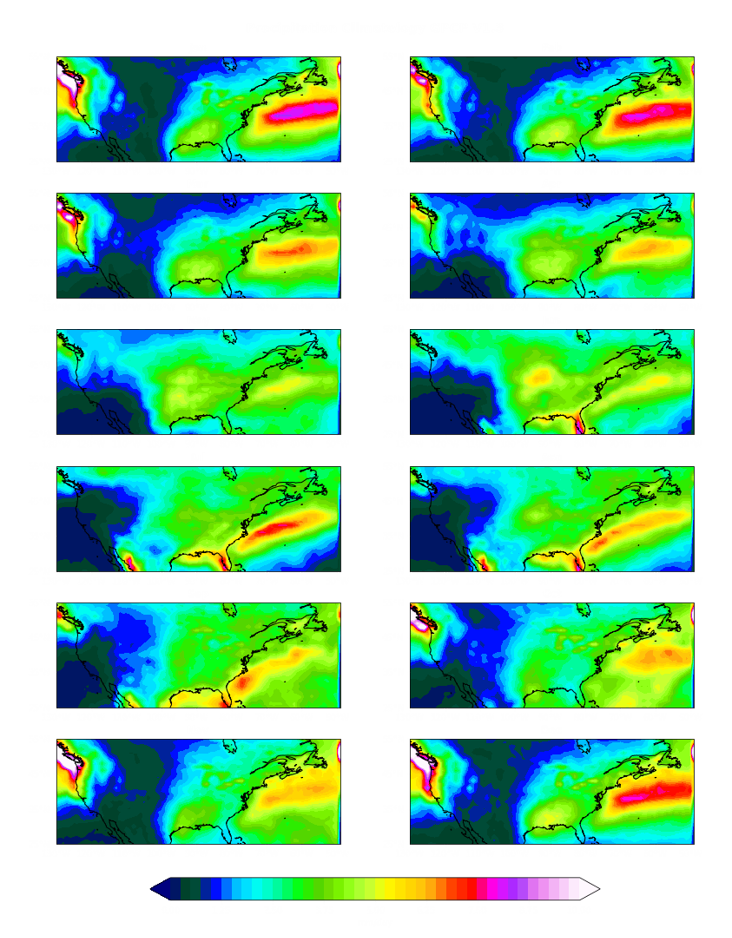
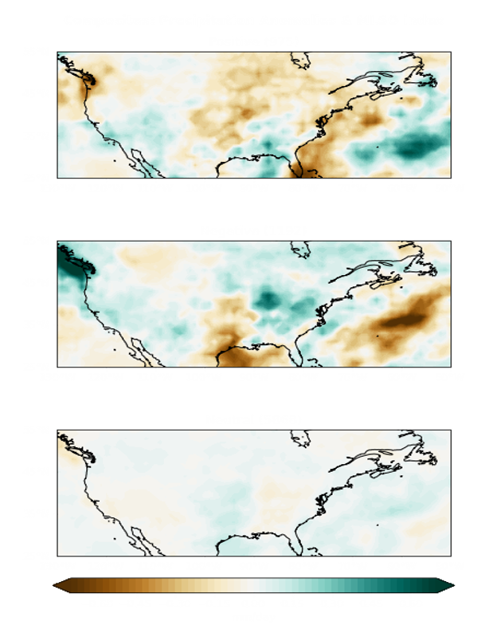
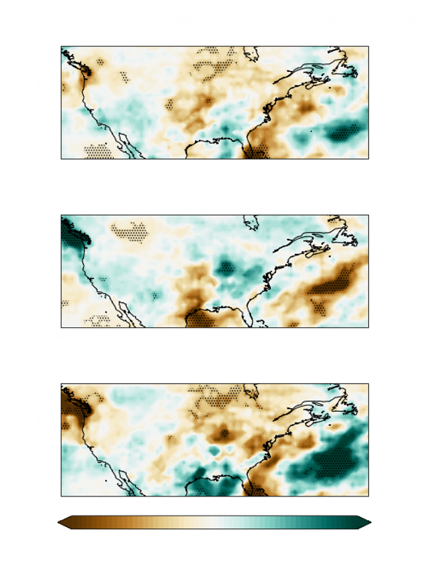
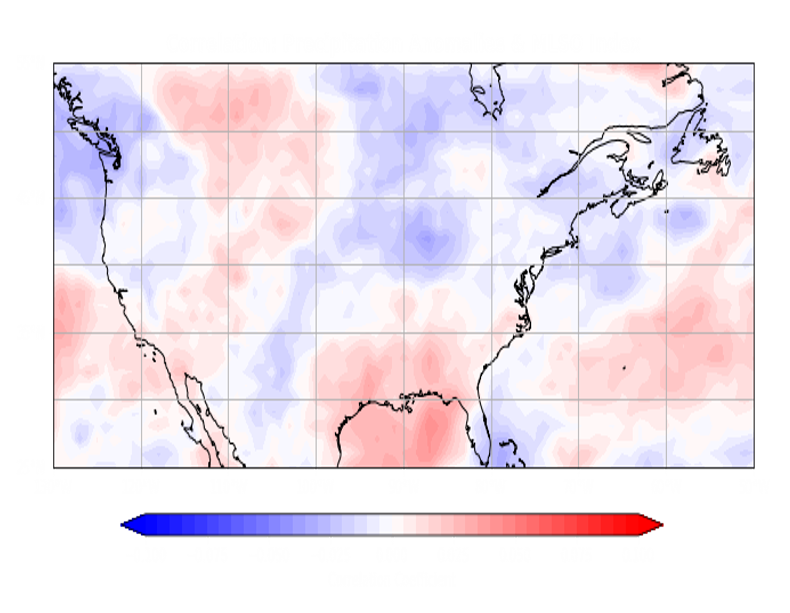
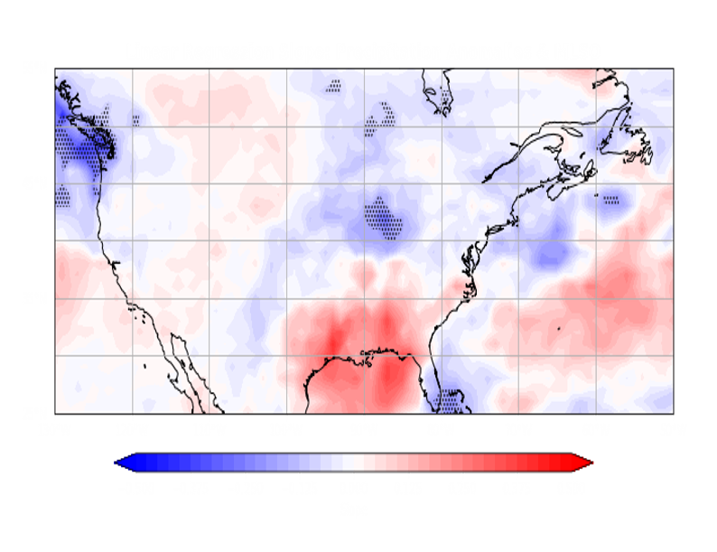
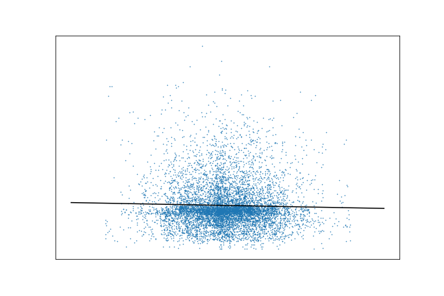

# Class Project: Dataset Investigation
## Global Precipitation Climatology Project (GPCP) & Mid-Latitude Seasonal Ocsilation (MLSO)
#### *Zak Manthos*
***
## The Question:
The main scientific topic I want to explore is precipitation variability. Precipitation and other weather phenomena vary for many reasons which vary in scale from meters to tens of thousand of kilometers and from minutes to decades. Trying to understand the reasons why precipitation does what it does is a complex set of questions that if answered could have major societal benfits.

In much of the analyses completed I try to connect the dots, if any, between precipitation and the Mid-Latitude Seasonal Oscillation (MLSO). It is well documented that there are large scale teleconnections, like ENSO, that have can influence precipitation over large areas and timescales. The MSLO is akin to the larger teleconnections and oscillation, it is a mode of variability for the Northern Hemisphere. It has an average period of 120 days. The MLSO has phases that lineup closely with the North Atlantic Oscillation (NAO) and the Pacific North American pattern (PNA), both of which have been shown to cause precipitation variability across North America.

An El Nino Southern Oscillation (ENSO) index is also used for a comparison.

***

## The Datasets:
**GPCP Dataset:**

The GPCP dataset is a one degree by one degree daily dataset that covers the time span of 1996-10-01 to 2020-05-31. This dataset is derived from satelite data. The dataset has been shown to match up well with reanalyses and ground measurements for the daily precipitation values. 

Article: [Global-Precipitation-at-One-Degree-Daily](http://journals.ametsoc.org/jhm/article/2/1/36/4943/Global-Precipitation-at-One-Degree-Daily)
    
 - Location: /scratch/zmanthos/GPCP/
 - Files: gpcp_v01r03_daily.2020.nc  Yearly with Daily data
 - Date Range: 1996-10-01 to 2020-05-31
 - Grid resolution: 1x1 degree
 - Source: University of Maryland, Earth Systems Science Interdisciplinary Center
 - *Lots of Metadata stored in the files
    
**MLSO Index:**

The MLSO is a daily standardize climate index for a mode of variability in the Nothern Hemisphere. The index spans from 1979-01-01 to 2019-08-31.

Article: [Intra‑seasonal and seasonal variability of the Northern Hemisphere extra‑tropics](http://doi.org/10.1007/s00382-019-04827-9)

 - Location: /data/vortex/scratch/
 - File: mlso.index.01011979-08312019.nc
 - Date Range: 1979-01-01 to 2019-08-31
 - Resolution: Daily
 - Source: George Mason University, Ph.D. Cristiana Stan

**ENSO Index**

This ENSO index is a quasi-daily standardized index for the NINO 3.4 region. It is quasi daily because the dataset used, NOAA Optimum Interpolation (OI) Sea Surface Temperature (SST) V2, is weekly data. The OISSTv2 data used gives a weekly NINO 3.4 index that is then projected onto a daily time series. This leads to a daily index but all seven days of a given week have the same values for the index. This Index spans from 1997-01-01 to 2018-12-31 and only used SST data from that time period.

 - Location: /homes/zmanthos/thesis/index/
 - File: enso.nin34.97-18.nc
 - Date Range: 1997-01-01 to 2018-12-31
 - Resolution: Daily
 - Source: George Mason Univeristy, Zak Manthos

***

## The Analysis:

### ***Climatology***

First things first, below is a multi-panel plot of the climatology of the GPCP data, showing each month individually.

This plot shows well that the precipitation of North America has a large about of variability. Also prominent is the spatial distribution of the precipitation, with the Southwest and Rocky Mountains having significanly less precipitation than in the Southeast and Northwest.

Link to the code: [MMP Code](http://github.com/manthoszh/CLIM-680/blob/master/HW2.multipanelplot.ipynb)

Link to the plot: [MMP Plot](http://github.com/manthoszh/CLIM-680/blob/master/climatology.png)

### ***Precipitation and ENSO Index***

Next was a look into how large scale teleconnections affect precipitaton. The ENSO index was split into it's well known phases of El Nino, La Nina, and the neutral inbetween. Then the plots below were created to see the average precipitation anomalies for each phase.

These plots show large differences between the phases. Also note the number of days in each phase, neutral heavily outways the others with almost 5 times as many days averaged together.

Link to the code: [ENSO-Composite Code](http://github.com/manthoszh/CLIM-680/blob/master/ENSO.composites.ipynb)

Link to the plot: [ENSO-Composite Plot](http://github.com/manthoszh/CLIM-680/blob/master/enso.compos.png)

### ***Precipitation and MLSO Index***

After taking a look at the composites for precipitation and the ENSO index I looked at composites for precipitation and the MLSO index. This is the same analysis as above but with a different index.

These plots are similiar to the ENSO composites but do vary. They do have areas that switch between positive and negative anomalies but the spatial distribution is not as simple.

Below are plots of the differences between the MLSO composites. The stippling in these plots, and all plots below, shows areas that obtained a p-value less than 0.05 in a 2 sample T-test. 

The "statistically significant" areas on these plots are realatively small and most likely would disapper if a field significance test was used. The plots that subtract out the neutral phase are bascially the same as  if they hadn't been. The neutral phase has too many days and the plot becomes to smoothed to have pronounced anomalies. The positive - negative (P-N) plot shows areas of strong differences. These differences would suggest that the precipitation anomalies in these areas might correlate well to the MLSO index. 

Link to the code: [MLSO Composites Code](http://github.com/manthoszh/CLIM-680/blob/master/DIFF.composites.ipynb)

Link to the plots: [MLSO Composites](http://github.com/manthoszh/CLIM-680/blob/master/mlso.compos.png)   [Composite Differences](http://github.com/manthoszh/CLIM-680/blob/master/mlso.diffs.png)

### ***Correlation between Precipitation and MLSO Index***

For this next analysis I aim to investigate if there are areas of strong correlation between the MLSO index and precipitation. The hope is that the strong differences seen in the P-N composite will translate to correlation.

A basic lack of correlation is seen in the very small correlation values and as one would expect with such low values there are zero statistically significant areas. One positive note is that the signs of the correlation line up with the P-N composite.

Link to the code: [Correlation Code](http://github.com/manthoszh/CLIM-680/blob/master/Correlation.ipynb)

Link to the plot: [Correlation Plot](http://github.com/manthoszh/CLIM-680/blob/master/gpcp.mlso.corr.png)

### ***Linear Regression between Precipitation and MLSO Index***

After seeing the lack of significant correlation between precipittion and the MLSO index but also seeing a spatial pattern that lines up with the P-N composite, a linera regression analysis was done. For this analysis there is a hope that the spatial pattern in the correlations might translate to a more meaningful result.

This plot lines up well with the spatial distribution of the correlation plot but shows larger values and has areas that are significant. Linear regression analysis might be a better way to go about understanding the relationship between precipitation and an index but it is far from perfect.

Below is a plot of the linear regression of a single point in a statistically significant area in the Northwest.

This plot shows the complexity of dealing with precipitation data. There are so many factors that go into the why precipitation occurs that there is basically a zero percent chance that a single index will explain what actually happens.

Link to the code: [Regression Code](http://github.com/manthoszh/CLIM-680/blob/master/Regression.ipynb)

Link to the plots: [Regression Plot](http://github.com/manthoszh/CLIM-680/blob/master/gpcp.mlso.regres.png)   [Single Point Plot](https://github.com/manthoszh/CLIM-680/blob/master/single.regres.png)

***

## The Summary:

In summary, I learned nothing... JK. This project has shown and taught me a lot about about both my dataset, GPCP, and how to code in python. In the code can be seen dataset problems I ran into. The data contained nans and the timeseries of the dataset and indexes didn't always line up. These lead to both google searches and creative looping to fix problems and verify that everything was fixed or worked around properly. Outside of data problems i found that precipitation is inherently difficult to work with, not because of the data itself but because of the chaotic nature of precipitation. The composites showed that there are strong differnces in precipitation anaomalies for the different phases of the ENSO and MLSO indices. These differences did not hold true for the MLSO index in the correlation analysis where there was basically no correlation. Eventhough the correlation analysis was a let down, the regression analysis showed more promise with some areas of statistical significance. This was short lived when seeing the single point plot was basically a blob surrounding a line.

These analyses revealed the difficulty of analyzing precipitation and has set forth the question of how to best analyze the data to reveal useful information. Future research will use more index bins, ie positive, neutral, etc., which will cause a change in the bin thresholds. With different and or more bins you can spread out the data so that you do not get one bin with 5000+ days out of 8000. Also instead of looking at the magnitude of precipitation I plan on doing analyses based on the binanry did it precipitate or not. The thinking being that large scale variation and patterns are more likely to change the probability of precipitation and not necessarily the amount of precipitation.

*42*